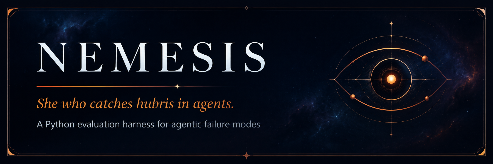
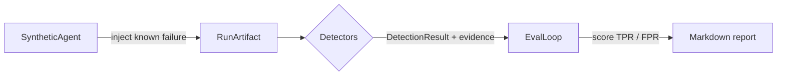
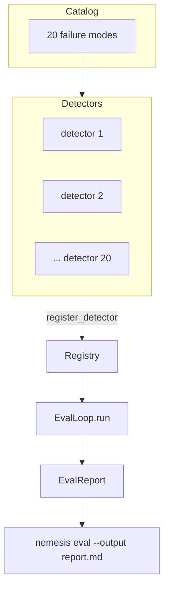

<p align="center">
  
</p>

<p align="center">
  <a href="https://github.com/LueBangs-coder/nemesis-eval/actions/workflows/ci.yml"></a>
  
  
  
  
</p>

<p align="center">
  <em>When an AI coding agent says "I'm done" — is it really? Nemesis checks.</em>
</p>

---

## Contents

- [Why Nemesis exists](#why-nemesis-exists)
- [How it works](#how-it-works)
- [The catalog](#the-catalog)
- [Install](#install)
- [Usage](#usage)
- [Part of something larger](#part-of-something-larger)
- [Contributing](#contributing)
- [A note from the author](#a-note-from-the-author)
- [License](#license)

---

## Why Nemesis exists

When an AI coding agent reports success, the claim is only as trustworthy as the verification behind it. Sometimes the agent really finished. Often it finished its *checklist* but never confirmed the real state of the world — the tests, the files, the repository.

Nemesis turns a catalog of **twenty real, observed agent failure modes** into automated detectors. Each detector inspects a run artifact — the agent's transcript, the repository state, the agent's own claim of success — and reports whether the corresponding failure occurred, **with evidence**.

**The deeper reason this is public is education.** The best way to learn how an AI-safety harness is actually built is to read one that works. If you are teaching yourself, breaking into the field, or simply curious how this is done — this repository is yours to read, fork, and learn from. That is the point. Giving back to the community is the reason, not an afterthought.

---

## How it works

Three primitives and a loop.

- **Failure mode** — a named, documented production failure (the catalog).
- **Detector** — code that inspects a run artifact and returns whether its target failure occurred, with evidence.
- **Synthetic agent** — a controllable fake agent that injects known failures on demand, so detectors can be validated against ground truth.



The eval loop runs every registered detector against known-truth runs and scores each one on two axes:

- **True-positive rate (TPR)** — did the detector catch its target failure when it was present?
- **False-positive rate (FPR)** — did it stay silent on clean runs and on *other* modes' failures?

A good detector scores TPR = 1.00 and FPR = 0.00. The current suite hits that across all twenty modes.



---

## The catalog

Twenty production failure modes, grouped into five categories. Every mode has a detector in [`src/nemesis/detectors/`](./src/nemesis/detectors/).

| Category | Modes | Theme |
| --- | --- | --- |
| Verification and ground truth | 8 | Agent self-report diverging from real system state. Maps to scalable oversight. |
| State hygiene and closeout | 5 | Silent state leakage between phases. |
| Doctrine and multi-agent coordination | 3 | Emergent failures when more than one agent shares a substrate. |
| Scope and specification | 2 | Failures from ambiguous or partial instruction. |
| Skill design and prompt safety | 2 | Capability sprawl and unsafe prompt language. |

The full list lives in [`data/failure_modes.yaml`](./data/failure_modes.yaml). The flagship detector targets **`agent_declared_success_too_early`** — the agent finishes its internal checklist but never verifies the real repo state. It is, in miniature, the alignment problem of model self-report versus ground truth.

---

## Install

Requires Python 3.11+.

From PyPI (installs the `nemesis` command):

```bash
pip install nemesis-eval
```

> The distribution is named **`nemesis-eval`**; the import package and CLI are
> both **`nemesis`**.

From source, for development:

```bash
git clone https://github.com/LueBangs-coder/nemesis-eval.git
cd nemesis-eval
python -m venv .venv
source .venv/bin/activate          # Windows: .venv\Scripts\Activate.ps1
pip install -e ".[dev]"
pytest
```

---

## Usage

Run every detector against synthetic known-truth runs and print the scores:

```bash
python -m nemesis eval
```

Write a structured Markdown report instead of printing:

```bash
python -m nemesis eval --output report.md
```

The report lists, for each failure mode, the true-positive rate, the false-positive rate, and sample evidence for every detection — and links back to the build log.

### Checking a real repository

`nemesis eval` is the self-test against synthetic runs. To run the detectors
against a **real** repository, use `nemesis check`:

```bash
python -m nemesis check --repo . --claimed-success --tests-passing false
```

It builds the run artifact from **read-only** git state (worktree status,
branch, HEAD, upstream parity) plus the run context you provide. **Nemesis
never executes the project's tests or any project code** — you pass the test
outcome with `--tests-passing`, so pointing it at an untrusted repo is safe.
Add `--output report.md` to write a Markdown check report. Pass
`--fail-on-detect` to exit non-zero when any failure mode fires (useful in CI).

### Use it in CI (GitHub Action)

Nemesis ships a composite action so any repository can run a check in its
workflow. By default it fails the job when a failure mode is detected:

```yaml
# .github/workflows/nemesis.yml
name: Nemesis check
on: [pull_request]
jobs:
  nemesis:
    runs-on: ubuntu-latest
    steps:
      - uses: actions/checkout@v4
      - uses: LueBangs-coder/nemesis-eval@v0.2.0
        with:
          repo: "."
          fail-on-detect: "true"   # set "false" for report-only
```

Inputs: `repo`, `transcript`, `claimed-success`, `tests-passing`, `output`,
`fail-on-detect`, `package-version`, and `python-version`. Leave
`package-version` empty to use the version bundled with the pinned action ref,
or set it (e.g. `"0.2.0"`) to install that release from PyPI.

---

## Scope & limitations

Nemesis has two surfaces, and they cover different ground today:

- **`nemesis eval`** exercises **all 20 detectors** against *synthetic*
  known-truth runs — a closed test bed where each failure is injected on
  purpose. This is how the detectors are validated (true-positive and
  false-positive rates), and why every detector scores well there.
- **`nemesis check`** runs against a **real** repository, but it can only act
  on signals that are observable from read-only git state — worktree
  cleanliness, branch, HEAD, upstream parity — plus the run context you pass in
  (`--claimed-success`, `--tests-passing`, `--transcript`). Today that means a
  **subset** of the catalog fires on real repos (for example
  `agent_declared_success_too_early` and `dirty_worktree_after_closeout`); the
  remaining detectors depend on richer run context that the collector does not
  yet derive.

In short: the catalog and the synthetic eval are complete; broadening what
`nemesis check` can observe on real repositories is active, ongoing work. This
project does not over-claim what it verifies — that honesty is the point.

---

## Part of something larger

Nemesis is one guardian in a growing **pantheon** — a body of harnesses built to keep AI systems honest, bounded, and safe. Each guardian owns one part of the problem:

| Guardian | Role | Status |
| --- | --- | --- |
| **Nemesis** | *The reckoning.* Catches the failures that slip past the gate — the false "done," the unverified success, the dishonest report. Honesty auditing after the fact. | **Live (this repo)** |
| **Terminus** | *The boundary.* Stands at the threshold and refuses destructive actions before they execute. Fail-closed by design. | Coming |
| **Ananke** | *Necessity.* Holds another class of agents to the same fail-closed discipline. | Coming |
| **Janus** | *The gatekeeper of transitions.* Governs how work moves cleanly between phases and tools. | Coming |
| **Argus** | *The all-seeing.* Continuous watchfulness over running systems. | Coming |
| **Cerberus** | *The gatekeeper.* Guards access at the threshold. | Coming |

More guardians are on the way. Each arrives when it is ready — and only then. The wider system is still in private development; Nemesis is the first piece released to the world.

---

## Contributing

See [`CONTRIBUTING.md`](./CONTRIBUTING.md) for how to add a detector or report an issue, and [`CODE_OF_CONDUCT.md`](./CODE_OF_CONDUCT.md) for community expectations. The build log in [`BUILD_SPEC.md`](./BUILD_SPEC.md) walks the whole project phase by phase — read it if you want to learn how this was made.

---

## A note from the author

I build guardians for AI.

I didn't start here as an engineer. I came back to Python to build this — years after I first learned it in college, basically learning it all over again — because I cared enough about this problem to learn, line by line, how to build the thing I believed needed to exist. Nemesis is the proof that you can.

AI safety is my highest concern and my deepest passion. Nemesis is one piece of a larger body of work, and more guardians are coming. If you're here to learn, or to find your own way into this field, I hope this helps you the way building it helped me.

This is me giving back. It's just the beginning.

**— Luis A. Betancourt**
Founder & Operator, Onslaught Gaming LLC · U.S. Army veteran (Armored Crewman) · Tampa, Florida

- Email: therealonslaughtgaming@gmail.com
- LinkedIn: [linkedin.com/in/luis-betancourt-39377b302](https://linkedin.com/in/luis-betancourt-39377b302)
- Portfolio: [onslaughtgaming.carrd.co](https://onslaughtgaming.carrd.co)

---

## License

Released under the **MIT License** — see [`LICENSE`](./LICENSE).

Copyright © 2026 Luis A. Betancourt. You're free to use, modify, and
distribute Nemesis — including commercially — at no cost, for the community.
The only condition is keeping the copyright and license notice. Ownership of
the work stays with the author; the freedom to use it is yours.

---

<p align="center"><em>Built in the pantheon's shadow.</em></p>
